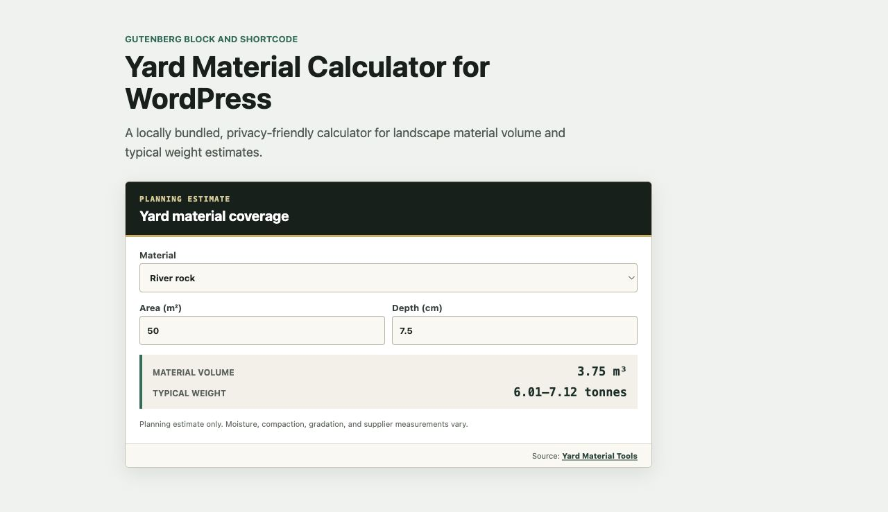

# Demi Yard Material Calculator for WordPress

Add a locally hosted yard material calculator with either a Gutenberg block or
the `[yard_material_calculator]` shortcode.



The plugin bundles the Web Component from
[`@demi-valerith/yard-material-coverage-data`](https://www.npmjs.com/package/@demi-valerith/yard-material-coverage-data).
It does not download executable code at runtime.

## Shortcode

```text
[yard_material_calculator material="Pea gravel" materials="Pea gravel,Crushed stone,River rock" area="500" depth="3" unit="imperial" accent="#ab4c29" attribution="false"]
```

Supported attributes:

- `material`: initial material;
- `materials`: comma-separated material allowlist;
- `area` and `depth`: positive initial values;
- `unit`: `imperial` or `metric`;
- `accent`: six-digit hexadecimal color;
- `attribution`: `true` or `false`, disabled by default.

## Privacy

The calculator uses no cookies, analytics, browser storage, or background
network requests. Enabling attribution adds a source link; its UTM parameters
are transmitted only when a visitor clicks it.

## Development

```sh
npm test
npm run build
```

`npm run sync-widget` copies the exact npm widget into `assets/widget.js` and
records its SHA-256 digest. `npm run build` creates the installable ZIP under
`dist/`.

After the first release is available, open the included
[`blueprint.json`](blueprint.json) in
[WordPress Playground](https://playground.wordpress.net/?blueprint-url=https://raw.githubusercontent.com/demi-valerith/yard-material-calculator/main/blueprint.json)
to install the release and render both the Gutenberg block and shortcode on a
temporary WordPress site.

## Licenses

The WordPress plugin is GPL-2.0-or-later. The bundled Web Component is MIT.
The embedded density values are derived from the Yard Material Tools dataset,
which is CC BY 4.0; attribution is retained in `third-party-notices.txt`.
